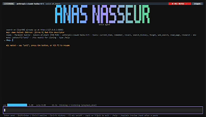

<div align="center">

# voiceAgent

**A local, real-time voice agent you can talk over.**

Parakeet listens · Claude Haiku thinks · Kokoro speaks · SQLite remembers

A fully local, real-time voice assistant for Windows — sub-second speech-to-speech latency, barge-in interruption, web search, tool use via MCP, and voice cloning. Built from the ground up with [Parakeet](https://huggingface.co/nvidia/parakeet-tdt-0.6b-v3) (ASR), [Silero VAD](https://github.com/snakers4/silero-vad), [Kokoro-82M](https://github.com/hexgrad/kokoro) (TTS), and [LangGraph](https://github.com/langchain-ai/langgraph).

[](https://www.python.org/)
[](https://www.microsoft.com/windows)
[](https://developer.nvidia.com/cuda-toolkit)
[](LICENSE)



</div>

---

## Latency (RTX 4090, CUDA 12, Windows 11)

| Stage | Latency |
|---|---|
| Parakeet one-pass, 4.4 s clip (hybrid) | 45 ms best / 79 ms median |
| Parakeet one-pass, 64 s monologue (hybrid) | 147 ms best / 169 ms median (RTFx 437) |
| Silero VAD per 32 ms chunk (CPU) | 0.6 ms p50 / 0.7 ms p95 |
| Kokoro first audio from token stream | ~450 ms |
| Groq gpt-oss-20b: first speakable sentence | 270–330 ms |
| Anthropic claude-haiku-4-5: turn end → first audio | 1.7–1.9 s |
| Groq gpt-oss-20b: turn end → first audio | ~1.1 s |

Full benchmark write-up: [`results/REPORT.md`](results/REPORT.md)

---

## Architecture

```
mic ─ Silero VAD ─┬─ EchoGate ─ StateMachine ─ barge-in
                  ├─ live partials (Parakeet re-decodes every 0.6 s for the UI)
                  └─ utterance ─ Parakeet ─ Brain (LangGraph + tools, streaming) ─ Kokoro ─ speaker
```

Full component map: [`ARCHITECTURE.md`](ARCHITECTURE.md)

---

## Features

- **Real-time transcription** — Parakeet TDT 0.6B on CUDA + int8 CPU decoder hybrid; 45–170 ms one-pass latency
- **Smart endpointing** — Smart Turn v3.2 holds mid-sentence pauses (0.3–0.6 s) and fires at real turn ends
- **Two-stage barge-in** — 96 ms of speech ducks TTS to 25%; 320 ms of sustained speech cuts it entirely; echo-gated so the agent doesn't interrupt itself
- **Streaming TTS pipeline** — Kokoro splits LLM output into sentences; first audio in ~450 ms from turn end
- **Voice cloning** — NeuTTS-Air engine clones any voice from a 3–15 s clip, hot-swappable at runtime
- **Web search** — SearXNG (self-hosted, no Docker needed) + Trafilatura for full-page reading
- **MCP tool support** — attach any stdio or HTTP MCP server at runtime; ships with a local demo server
- **SQLite memory** — full-text search over conversation history; the agent remembers across sessions
- **Textual TUI** — scrollable conversation, multi-line editor, paste presets, mic mute, F2 wake word
- **Groq key pool** — rotate up to N keys on rate limits so the conversation never stalls

---

## Requirements

- Windows 10/11 (tested on Windows 11)
- Python 3.11
- NVIDIA GPU with CUDA 12.x support (driver ≥ 551; driver ≥ 580 lifts all version pins)
- [uv](https://github.com/astral-sh/uv) package manager
- At least one LLM provider API key (Anthropic, Groq, or Gemini)

> **CPU-only?** The agent falls back to CPU automatically; ASR latency rises to ~300 ms per utterance on a modern CPU.

---

## Setup

### 1. Clone and create the virtual environment

```powershell
git clone https://github.com/nodeblackbox/voiceAgent.git
cd voiceAgent
uv venv --python 3.11 .venv
```

### 2. Install core dependencies

```powershell
uv pip install --python .venv/Scripts/python.exe -r requirements.txt
```

### 3. Install CUDA-specific packages (skip if CPU-only)

```powershell
# ORT 1.26 targets CUDA 12; upgrade your driver to ≥ 580 to use newer ORT builds
uv pip install --python .venv/Scripts/python.exe `
  "onnxruntime-gpu==1.26.0" `
  "nvidia-cudnn-cu12==9.1.1.17" `
  "nvidia-cuda-runtime-cu12==12.4.*" `
  "nvidia-cublas-cu12==12.4.*" `
  "nvidia-cufft-cu12==11.2.*" `
  "nvidia-curand-cu12==10.3.9.*" `
  "nvidia-cuda-nvrtc-cu12==12.4.*"
```

> **Why pin cuDNN 9.1?** cuDNN ≥ 9.25 fails on drivers below 580 with `CUDNN_BACKEND_API_FAILED`, and onnxruntime silently falls back to CPU. The pin keeps it loud and correct.

### 4. Install Kokoro TTS (CUDA build)

```powershell
# PyPI ships a CPU-only torch on Windows; install the CUDA wheel first
pip install torch --index-url https://download.pytorch.org/whl/cu124
uv pip install --python .venv/Scripts/python.exe kokoro==0.9.4
```

### 5. Configure your API keys

```powershell
copy .env.example .env
# then edit .env and fill in your keys
```

See `.env.example` for all supported variables. At minimum you need one of: `ANTHROPIC_API_KEY`, `GROQ_API_KEY`, or `GEMINI_API_KEY`.

Models auto-download from Hugging Face on first run (~4–5 GB total into `~/.cache/huggingface`).

---

## Running the agent

```powershell
# Default: Claude Haiku 4.5, Kokoro af_heart voice, first available mic
.venv\Scripts\python.exe agent\talk.py

# Faster first sentence (Groq inference)
.venv\Scripts\python.exe agent\talk.py --model groq:openai/gpt-oss-20b

# Typed input only (no mic), agent still speaks
.venv\Scripts\python.exe agent\talk.py --no-mic

# Plain log output instead of Textual TUI
.venv\Scripts\python.exe agent\talk.py --plain

# Send turns from the command line (automated testing)
.venv\Scripts\python.exe agent\talk.py --plain --say "what time is it" "roll two dice"
```

---

## Slash commands (type while the agent runs)

| Command | Effect |
|---|---|
| `/model groq:openai/gpt-oss-20b` | Hot-swap the LLM (`fast`, `smart`, `opus`, `sonnet`, `gemini`, `qwen` are aliases) |
| `/voice af_bella` | Switch Kokoro voice without reloading |
| `/tts neutts` / `/tts kokoro` | Hot-swap TTS engine |
| `/clone my.wav\|exact transcript` | Clone a voice from an audio clip |
| `/search on\|off` | Enable/disable web tools; `on` starts SearXNG automatically |
| `/mcp on demo` / `/mcp off demo` | Attach or detach an MCP server at runtime |
| `/tools` | List all tools and which server they come from |
| `/memory notes` | Show memory notes |
| `/mic` | Toggle mic mute (also: F2 key or the button in the TUI) |
| `/verbose on\|off` | Show/hide internal telemetry in the conversation view |
| `/help` | Full command list |

---

## Voice cloning — NeuTTS-Air

Kokoro ships fixed voices (`af_heart`, `af_bella`, `af_sky`, `am_adam`, etc.). NeuTTS-Air adds zero-shot voice cloning from any 3–15 s clip. It runs in a separate venv because it requires `torch ≥ 2.8`.

```powershell
# Set up the NeuTTS venv (one-time, ~5 GB)
uv venv --python 3.11 .venv-neutts
# follow tts/README_NEUTTS.md for the full pin list

# Start the agent on the cloned voice
.venv\Scripts\python.exe agent\talk.py --tts-engine neutts --neutts-voice paul
```

Details and timing numbers: [`tts/README_NEUTTS.md`](tts/README_NEUTTS.md)

---

## Web search

SearXNG runs from source (no Docker required) in its own venv. `search/settings.yml` enables the JSON API, disables the bot-limiter for localhost, and selects engines that work without a browser (Google, Brave, Startpage, Wikipedia).

```powershell
.venv\Scripts\python.exe search\run_searxng.py          # start
.venv\Scripts\python.exe search\run_searxng.py --check  # health check
```

The agent auto-starts SearXNG when `/search on` is used. Tools: `web_search`, `read_page`, `research`.

---

## MCP servers

`agent/mcp.json` declares servers. A local demo server ships enabled by default (calculator, unit conversion, dice). Add any stdio or streamable-HTTP MCP server:

```json
{
  "servers": {
    "my-server": {
      "transport": "stdio",
      "command": "npx",
      "args": ["-y", "my-mcp-package"],
      "enabled": true,
      "description": "..."
    }
  }
}
```

Attach/detach at runtime with `/mcp on my-server` / `/mcp off my-server`.

---

## Project layout

```
agent/          Core agent loop, brain, state machine, UI, tools
  talk.py         Entry point — the full voice loop
  brain.py        LangGraph agent with tool support
  tui.py          Textual TUI
  endpoint.py     Smart Turn endpointing
  echo_gate.py    Echo cancellation (self-interruption guard)
  memory.py       SQLite memory with FTS5 search
  tools_web.py    Web search and page-reading tools
  mcp.json        MCP server declarations

bench/          Benchmarking scripts (offline ASR, VAD, turn model)
llm/            LLM provider abstraction (LiteLLM, Groq key pool)
tts/            Kokoro and NeuTTS-Air streaming wrappers
search/         SearXNG launcher and settings
models/         Smart Turn ONNX model (v3.2)
audio/          Reference transcripts for offline benchmarks
results/        Benchmark reports and logs
```

---

## Known limits

- **No streaming ASR** — Parakeet runs one-pass after each utterance; streaming (Sherpa-ONNX) is possible but not implemented
- **No word boosting** — onnx-asr has no context-biasing hook; NeMo on Linux is needed for that
- **Windows-only** for now — SearXNG has one Unix-only import that is patched; NeuTTS subprocess comms use binary stdin/stdout. PRs for Linux/macOS welcome

---

## License

MIT
